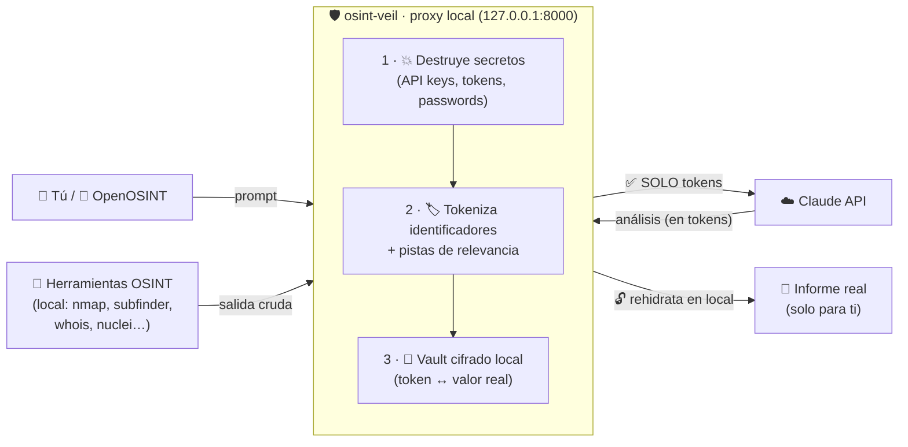

<div align="center">

# 🛡️ osint-veil

### OSINT autónomo con IA — **sin que tus datos reales salgan de la máquina**

Un **velo de privacidad** entre tus herramientas OSINT y la IA. Deja que Claude
(o OpenOSINT) haga el reconocimiento casi solo, mientras el proxy **destruye los
secretos y tokeniza los identificadores** antes de que nada llegue a la nube.

<p>
  
  
  
  
</p>

**Regla de oro:** _nada llega a Claude si antes no pasa por el velo._

</div>

---

## 📑 Índice

- [¿Por qué?](#-por-qué)
- [Cómo funciona (workflow)](#-cómo-funciona-workflow)
- [Funcionalidades](#-funcionalidades)
- [Instalación en 1 comando](#-instalación-en-1-comando)
- [Primeros pasos (tutorial)](#-primeros-pasos-tutorial)
- [Con OpenOSINT](#-con-openosint)
- [Demostrar la privacidad](#-demostrar-la-privacidad)
- [Comandos (CLI)](#-comandos-cli)
- [Configuración](#-configuración)
- [Arquitectura e invariantes](#-arquitectura-e-invariantes)
- [Qué se detecta](#-qué-se-detecta)
- [Garantías y límites](#-garantías-y-límites)

---

## 🎯 ¿Por qué?

Usar IA para OSINT/pentesting es potentísimo… pero **el prompt y los hallazgos van a
la API del proveedor**: se filtran datos del **cliente**, del **host** y del
**pentester**. En una auditoría real con NDA/RGPD, eso es inaceptable.

**osint-veil** se pone _delante_ de la IA y garantiza que el modelo razone sobre
**tokens** (`SUBDOMAIN_001`, `INTERNAL_IP_002`…), nunca sobre los valores reales.
Tú recibes el informe **rehidratado en local**.

> La API de Anthropic no entrena con datos enviados por API (y existe **ZDR**,
> retención cero, bajo acuerdo). Aun así, este proxy va un paso más allá: solo sale
> texto ya anonimizado, sin metadatos.

---

## 🔄 Cómo funciona (workflow)



**Paso a paso:**

1. Las herramientas corren **en tu máquina** (nunca en la nube).
2. Los **secretos se destruyen** — jamás llegan a la IA (ni se guardan, salvo vault opt-in cifrado).
3. Los **identificadores se tokenizan** con una *pista de relevancia* (la IA entiende el contexto sin ver el valor).
4. A Claude **solo le llega la versión anonimizada**.
5. El **informe se rehidrata en local**: tú ves los valores reales; la IA nunca los vio.

---

## ✨ Funcionalidades

| | Funcionalidad | Qué hace |
|---|---|---|
| 🤖 | **OSINT autónomo** | Claude decide qué herramientas usar; el bucle corre client-side |
| 💥 | **Destrucción de secretos** | 20+ patrones (GitHub, AWS, JWT, Bearer, claves PEM…) eliminados |
| 🏷️ | **Tokenización con pistas** | Emails, dominios, IPs, URLs, GUIDs, MAC, cripto… → tokens anotados |
| 🔐 | **Vault cifrado** (Fernet) | Mappings, hallazgos y audit-log cifrados por caso |
| 🧩 | **Puente OpenAI↔Anthropic** | Function calling: OpenOSINT funciona a través del proxy con privacidad |
| 🧠 | **Summarizer local** (opcional) | Ollama condensa salidas grandes antes de Claude (menos tokens) |
| 🚧 | **Egress lockdown** | Solo el proxy alcanza la IA; las tools corren sin salida (iptables) |
| 🛟 | **Anti prompt-injection** | La salida de tools se trata como dato hostil, nunca como orden |
| 📊 | **Informe accionable** | Resumen ejecutivo · activos descubiertos · Hallazgo/Impacto/Siguientes pasos · evidencia |
| 💸 | **Modo ahorro** | Haiku + summarizer local; `dry-run` para validar gratis |

---

## ⚡ Instalación en 1 comando

> Kali / Debian / Ubuntu. Instalador **guiado**: pregunta (con alternativas) antes de cada extra.

```bash
git clone https://github.com/lameiro0x/osint-veil && cd osint-veil
./setup.sh --all          # te pregunta por: toolkit OSINT · Ollama · OpenOSINT · Docker · lockdown
# o sin preguntas:
./setup.sh --all -y
```

`setup.sh` instala deps + venv + paquete + `.env` con **claves autogeneradas**,
ofrece pegar tu `ANTHROPIC_API_KEY`, instala Go/Ollama/Docker si los aceptas, y
termina con una **guía de próximos pasos**. Es idempotente (no pisa tus claves).

| Flag | Instala |
|---|---|
| `--tools` | Toolkit OSINT (whois, dns, nmap, subfinder, nuclei, whatweb… + Go) |
| `--ollama` | Summarizer local (Ollama + modelo) |
| `--openosint` | OpenOSINT (pipx) + `openosint.env` enrutado al proxy |
| `--docker` | Docker + Compose |
| `--lockdown` | Usuario sin-salida-IA + egress lockdown (iptables) |
| `--yes/-y` | Responde "sí" a todo (desatendido) |

<details>
<summary>Instalación manual</summary>

```bash
python3 -m venv .venv
source .venv/bin/activate
pip install -e ".[dev]"
cp .env.example .env
python -m proxy.keygen        # pega la clave en PROXY_ENCRYPTION_KEY
```
</details>

---

## 🚀 Primeros pasos (tutorial)

**1. Consigue tu API key de Anthropic** → [console.anthropic.com](https://console.anthropic.com)
(mete saldo, pon un *spend limit*) y ponla en `.env`:

```bash
ANTHROPIC_API_KEY=sk-ant-...
```

**2. Arranca el proxy** (elige uno):

```bash
make run          # sin Docker ni root (lo más rápido para probar)
make up           # con Docker (lockdown de red automático)
make secure-up    # bare-metal con lockdown enforce (root)
```

**3. Comprueba que vive:**

```bash
curl -s 127.0.0.1:8000/health        # {"status":"ok"}
```

**4. Lanza un OSINT autónomo** (la CLI hace todo: tools → tokeniza → Claude → informe):

```bash
osint-veil audit --case demo --target ejemplo.com
# análisis a full con escaneo activo y mejor modelo:
osint-veil audit --case demo --target vulnweb.com --allow-active --model claude-sonnet-4-6
```

**5. Lee el informe** (rehidratado, en local):

```bash
osint-veil report --case demo && cat informe_demo.md
```

> 💡 **Targets legales para probar:** `vulnweb.com` (Acunetix) y `scanme.nmap.org`
> (Nmap) están autorizados para escaneo. El modo `audit` por defecto es **pasivo**;
> lo intrusivo solo con `--allow-active`.

---

## 🧩 Con OpenOSINT

[OpenOSINT](https://github.com/OpenOSINT/OpenOSINT) es un agente OSINT con 18
herramientas. Enrutado **a través de osint-veil**, todo lo que mande a la IA pasa
por el sanitizador:

```bash
./setup.sh --openosint     # instala OpenOSINT (pipx) + openosint.env
make up                    # arranca el proxy
make openosint             # carga openosint.env y abre la REPL enrutada
```

El proxy implementa un **puente de function calling OpenAI↔Anthropic**: traduce las
`tools`/`tool_calls`, **sanitiza cada resultado de herramienta** antes de Claude, y
**rehidrata los argumentos** de los `tool_calls` para que OpenOSINT ejecute contra
los objetivos reales (un token no sirve para ejecutar).

> ⚠️ **No** des a OpenOSINT una `ANTHROPIC_API_KEY` directa: saltaría el proxy. Usa
> solo `OPENAI_BASE_URL`/`OPENAI_API_KEY` apuntando a osint-veil (lo deja `openosint.env`).

---

## 🔍 Demostrar la privacidad

**Validación gratis (`dry-run`)** — no llama a Claude, muestra qué se censura:

```bash
curl -s -X POST 127.0.0.1:8000/v1/chat/completions \
  -H "Authorization: Bearer <PROXY_LOCAL_API_KEY>" -H "Content-Type: application/json" \
  -d '{"case_id":"demo","dry_run":true,
       "messages":[{"role":"user","content":"admin@empresa.com en 10.0.0.5 token ghp_xxxxxxxx"}]}'
```

En la respuesta verás `EMAIL_001`, `INTERNAL_IP_001`, `SECRET_REMOVED` — el email, la
IP y el token **no aparecen**.

**Lo que vio Claude vs lo real** (la prueba definitiva):

```bash
osint-veil report --case demo --report informe_real.md            # valores reales (tú, local)
osint-veil report --case demo --anon --report informe_claude.md   # tokens (lo que vio Claude)
diff -y informe_real.md informe_claude.md                         # compáralos
```

**Cifrado en disco:**

```bash
head -c 400 proxy_data/demo/mappings.json   # ilegible (cifrado en reposo)
cat proxy_data/demo/audit-log.json          # solo tipos + conteos, sin valores
```

---

## 🖥️ Comandos (CLI)

```bash
osint-veil audit  --case C --target dominio.com [--allow-active] [--model M]   # OSINT autónomo
osint-veil report --case C [--anon]                                           # (re)genera el informe
osint-veil review --case C                                                    # hallazgos de alta relevancia
osint-veil secrets --case C [--reveal]                                        # secretos (local, opt-in)
osint-veil tools  [--allow-active]                                            # lista herramientas
```

**Herramientas del agente** (se activan solas si el binario está instalado):

- **Pasivas:** `subfinder`, `amass -passive`, `assetfinder`, `whois`, `dig`, `dnsrecon`, `theHarvester`.
- **Activas** (con `--allow-active` y autorización): `nmap`, `amass -active`, `whatweb`, `wafw00f`, `nuclei`.

**Atajos `make`:** `make help` los lista (`run`, `up`, `down`, `secure-up`, `audit`, `openosint`, `bootstrap`…).

---

## ⚙️ Configuración

`.env` (las claves las genera `setup.sh`). **Modo ahorro por defecto**: Haiku + summarizer Ollama.

| Variable | Para qué |
|---|---|
| `ANTHROPIC_API_KEY` | Tu clave de Anthropic |
| `ANTHROPIC_MODEL` | Modelo por defecto (ahorro: Haiku · calidad: Sonnet/Opus) |
| `PROXY_LOCAL_API_KEY` | Clave que exige el proxy (`Authorization: Bearer …`) |
| `PROXY_ENCRYPTION_KEY` | Clave Fernet del vault local |
| `PROXY_MODE` | `strict` (def.) · `balanced` · `reporting` |
| `PROXY_SUMMARIZER` | `off` · `ollama` (summarizer local) |
| `PROXY_EGRESS` | `off` · `warn` · `enforce` (lockdown de red) |

**Por caso** — `cases/<case_id>.yaml`:

```yaml
case_id: cliente_a_2026
model: claude-sonnet-4-6
mode: strict
sensitive_domains: [cliente.com, cliente.local]
sensitive_keywords: [vpn, intranet, payroll]
```

| Modo | Tokeniza |
|---|---|
| `strict` | **Todo** lo identificativo (incl. dominios/IPs públicas). Auditoría real. |
| `balanced` | Secretos + emails/IPs internas; deja pasar dominios/IPs públicas no sensibles. |
| `reporting` | Como balanced + permite rehidratar la salida si `rehydrate_output: true`. |

---

## 🏛️ Arquitectura e invariantes

**3 invariantes innegociables:**

1. **Client-side** — el bucle agéntico y las herramientas corren en local, no en la nube.
2. **Egress bloqueado** — a nivel de red solo el proxy alcanza a la IA; las tools corren como un usuario sin salida a Anthropic.
3. **Tool output = hostil** — la salida de herramientas se envuelve como _datos no confiables_ (anti prompt-injection), nunca como instrucción.

Extra: **budget** (iteraciones/tokens/tiempo) + kill-switch, **scope guard**, y un
**análisis final garantizado** (si se agota el presupuesto, una llamada sin tools
siempre entrega el informe).

📚 Detalle en [`docs/VISION.md`](docs/VISION.md) · [`docs/DESIGN.md`](docs/DESIGN.md) · [`docs/DEPLOY.md`](docs/DEPLOY.md).

---

## 🕵️ Qué se detecta

**Secretos (destruidos):** GitHub, OpenAI `sk-`, AWS `AKIA`, Slack `xoxb`, Google
`AIza`, Stripe `sk_live`, SendGrid, GitLab `glpat`, npm, Twilio, Azure
`AccountKey=`, JWT `eyJ…`, `Authorization: Bearer`, `Cookie:`, asignaciones
`password=`/`api_key=`/`secret_key=`…, y claves privadas PEM/PGP.

**Identificadores (tokenizados):** email, dominio/subdominio, IP interna/pública,
repo, URL, GUID (App/Tenant por contexto), cuenta de servicio, persona (NER spaCy
opcional), ruta, tarjeta (Luhn), MAC, dirección cripto, keyword del caso.

---

## ✅ Garantías y límites

**Garantiza:** nada sensible del cliente/host/pentester llega a la IA en claro ·
secretos destruidos · identificadores tokenizados · cifrado en reposo · egress
controlado.

**Límites (honestos):**

- Las **fuentes OSINT** (Shodan, VirusTotal…) sí ven el objetivo — eso es OSINT por naturaleza.
- La no-retención total requiere **acuerdo ZDR** con el proveedor.
- Es **DLP por patrones**: usa `dry-run` para verificar antes de auditar; amplía `sensitive_*` si hace falta.
- `proxy_data/` contiene los valores reales (cifrados con `PROXY_ENCRYPTION_KEY`). Protégelo (ya está en `.gitignore`).

---

<div align="center">

**Aprovecha la IA para OSINT… sin entregarle tus datos.**

Python · FastAPI · Anthropic SDK · cryptography (Fernet) · rich · 115 tests · MIT

[lameiro0x.com](https://lameiro0x.com)

</div>
